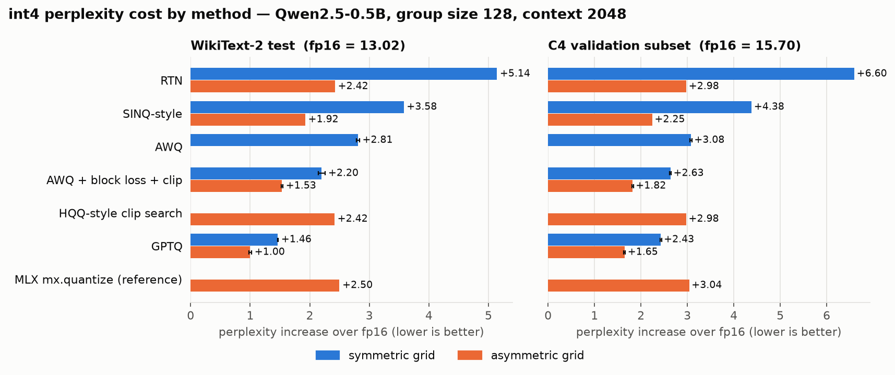
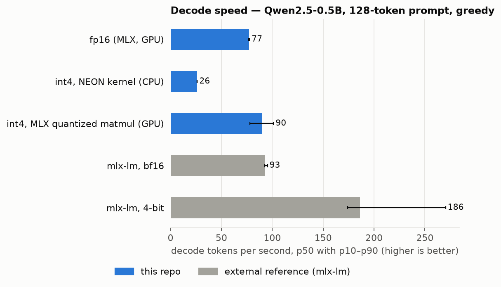
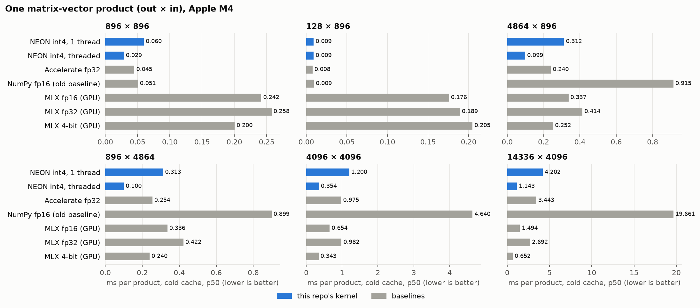

# siliconfer

A 4-bit LLM inference engine for Apple Silicon, written from scratch: GPTQ, AWQ
and two calibration-free quantizers; a C++/NEON int4 kernel; a decoder with KV
cache, int8 cache quantization and speculative decoding — with every reported
number backed by a file in [`results/`](results/).

[](https://github.com/ALI-AL-MARJANI/siliconfer/actions/workflows/ci.yml)


## TL;DR

<!-- PPL_TLDR -->
| WikiText-2 test perplexity, context 2048 | fp16 | RTN | AWQ + block loss + clip | GPTQ | MLX `mx.quantize` (reference) |
|---|---|---|---|---|---|
| symmetric grid, 4.25 bits/weight | 13.02 | 18.16 | 15.22 ± 0.06 | **14.48 ± 0.01** | — |
| asymmetric grid, 4.5 bits/weight | — | 15.44 | 14.55 ± 0.02 | **14.02 ± 0.02** | 15.52 |

Source: `results/ppl_full/` (whole test split: 145 windows, 296,960 scored
tokens; ± is the standard deviation over 3 calibration seeds). Best int4
configuration: GPTQ on an asymmetric grid, +1.00 perplexity over fp16.
<!-- /PPL_TLDR -->

| | fp16 | int4, NEON kernel (CPU) | int4, MLX quantized matmul (GPU) |
|---|---|---|---|
| Weight memory | 988 MB | 463 MB (2.1× smaller) | 474 MB (2.1× smaller) |
| Decode, tok/s, p50 (p10–p90), 128-token prompt | 77.3 (76.8–77.7) | 26.3 (26.0–26.3) | 89.6 (78.0–101.3) |
| Decode, tok/s, p50 (p10–p90), 2048-token prompt | 70.3 (69.9–70.5) | 25.1 (24.8–25.2) | 99.3 (98.9–99.6) |

Source: `results/bench/decode_Qwen2.5-0.5B.json` (10 runs of 256 greedy tokens
after one warm-up). External reference on the same machine and model, from
`results/bench/decode_mlx_lm_reference_Qwen2.5-0.5B.json`: mlx-lm bf16
93.0 tok/s, mlx-lm 4-bit 186.1 tok/s (128-token prompt).

**Setup:** Qwen2.5-0.5B (494 M parameters); MacBook, Apple M4, 16 GB; MLX
0.31.2; WikiText-2 test and a C4 validation subset, context 2048; 3 calibration
seeds for GPTQ and AWQ.

What these numbers do and do not show:

- int4 halves the model's weight memory (the projections alone go from 716 MB
  to 190 MB, 3.8×; the embedding/output head stays in fp16).
- The same int4 weights run 1.1–1.4× faster than fp16 on the GPU backend, and
  about 3× **slower** than fp16 through this repo's own NEON kernel, because
  each of the 168 quantized layers then forces a GPU→CPU round trip per token.
- mlx-lm's 4-bit path is about twice as fast as this repo's best path. It also
  quantizes the embedding/output head, which this repo does not.

## Motivation

Single-stream decoding multiplies every weight matrix by one vector per
token, so its cost is dominated by reading weights. Storing weights in 4 bits
instead of 16 cuts that traffic and the memory footprint by up to 4×, at some
cost in accuracy. This project implements the pieces needed to measure that
trade-off end to end on a laptop — the quantizers, the packed format, the
kernels and the decoder — rather than calling a quantization library.

## Method

```
HF safetensors ──> fp16 reference decoder (checked against transformers)
                         │
          calibration (128 × 512 tokens, WikiText-2 train)      weights only
                 │                    │                              │
               GPTQ                  AWQ                   HQQ-style / SINQ-style
                 └──────────┬─────────┴──────────────────────────────┘
               packed int4 codes + per-group scales (+ zero-points, + input scales)
                            │
        Q4Linear ──┬── NEON kernel (CPU): threaded GEMV, tiled GEMM
                   └── mx.quantized_matmul (GPU): same codes, converted losslessly
                            │
      decoder: RMSNorm · RoPE · GQA attention + KV cache (fp16 or int8) · SwiGLU · sampling
```

**Storage.** Group-wise int4: per (output row, group of 128 input columns)
one float32 scale, optionally a zero-point; two codes per byte. 4.25
bits/weight symmetric, 4.5 asymmetric.

**Quantizers** (details and equations: [`docs/methods.md`](docs/methods.md)):

| Method | Needs data | What it does | Departures from the reference |
|---|---|---|---|
| RTN | no | round to nearest | — |
| GPTQ | yes | column-by-column rounding with inverse-Hessian error feedback | grid fixed from the original weights (the reference's `static_groups=True`); no activation ordering; WikiText-2 calibration |
| AWQ | yes | per-input-channel scale `s = mean|x|^α`, α grid-searched | by default α is scored on one projection's output and no clipping; `--awq_block_loss --awq_clip` follow llm-awq; `1/s` is applied to the layer input instead of folded into the previous layer; [`docs/awq-vs-reference.md`](docs/awq-vs-reference.md) |
| HQQ-style | no | per-group clip-range search minimising an `ℓ_p` (p = 0.7) reconstruction loss | **not the HQQ solver**: keeps HQQ's objective, replaces its half-quadratic iteration by a 4-candidate search |
| SINQ-style | no | iterative per-column rescaling driven by relative reconstruction error | column scale only; the row scale is provably a no-op with per-(row, group) scales |

**Kernels** ([`docs/kernels.md`](docs/kernels.md)). The NEON GEMV unpacks 32
weights per 16 bytes with shifts, converts them to float32 and accumulates in
eight independent FMA chains; products above 2¹⁹ weights are split across the
performance cores. Prefill dequantizes one 1 MB row tile at a time and
multiplies it with Accelerate `sgemm`. The GPU backend re-expresses the same
codes in MLX's layout without re-quantizing.

**Serving.** A Llama-style decoder in MLX (logits match `transformers` on
Qwen2.5-0.5B: `tests/test_logit_parity.py`), with an optional int8 KV cache,
a Metal kernel that computes decode-step attention directly on the int8 cache,
and speculative decoding with standard rejection sampling
([`docs/speculative.md`](docs/speculative.md)).

## Experimental protocol

Full description: [`docs/eval-protocol.md`](docs/eval-protocol.md).

- **Model:** `Qwen/Qwen2.5-0.5B`. Quantized: the seven projections of each of
  the 24 blocks. Not quantized: embedding/output head (tied), norms, biases.
- **Perplexity:** non-overlapping 2048-token windows, float32 NLL.
  WikiText-2 raw *test*, and a fixed sample of C4 *validation* chosen by a
  seed that is independent of everything else (each result file stores a hash
  of the scored tokens). Two tiers: *full* (whole WikiText-2 test split,
  145 windows; 64 C4 windows) and *quick* (32,768 tokens each).
- **Reference check:** this repo's float32 forward pass and `transformers`
  give the same perplexity on the full WikiText-2 test split to within
  2.7 × 10⁻⁷ (`results/ppl/fp16_reference_validation.json`).
- **Calibration** (GPTQ, AWQ): 128 × 512 tokens from WikiText-2 *train*, three
  seeds; results are mean ± sample standard deviation.
- **Baselines:** RTN (simple); MLX's own quantizer `mx.quantize` applied to the
  same layers, and mlx-lm for speed (external references).
- **Speed:** otherwise idle machine, warm-up excluded, p50 with p10–p90.
- **Hyper-parameters** are the script defaults; every result file records its
  full configuration, git SHA, hardware and library versions.

## Results

All tables below are copied from [`results/SUMMARY.md`](results/SUMMARY.md),
which `scripts/make_results_tables.py` generates from the raw files.

### Perplexity

<!-- PPL_TABLE -->
Full tier — the whole WikiText-2 test split (145 windows, 296,960 scored
tokens) and 64 C4 validation windows (131,072 tokens); `results/ppl_full/*.json`.
Every run in a column was scored on the same tokens (the files record a hash).
A quick tier on 32,768 tokens per dataset (`results/ppl/`) gives the same
ordering; its table is in `results/SUMMARY.md`.



| Method | Grid | Bits/weight | WikiText-2 PPL | Δ vs fp16 | C4 PPL | Δ vs fp16 | Seeds |
|---|---|---|---|---|---|---|---|
| fp16 (unquantized) | — | 16 | 13.02 | — | 15.70 | — | 1 |
| RTN | sym | 4.25 | 18.16 | +5.14 | 22.29 | +6.60 | 1 |
| RTN | asym | 4.50 | 15.44 | +2.42 | 18.68 | +2.98 | 1 |
| SINQ-style column rescaling | sym | 4.25 | 16.60 | +3.58 | 20.08 | +4.38 | 1 |
| SINQ-style column rescaling | asym | 4.50 | 14.94 | +1.92 | 17.94 | +2.25 | 1 |
| AWQ (layer-output loss, no clip) | sym | 4.25 | 15.83 ± 0.02 | +2.81 | 18.78 ± 0.02 | +3.08 | 3 |
| AWQ + block loss | sym | 4.25 | 15.62 | +2.60 | — | — | 1 |
| AWQ + clip | sym | 4.25 | 15.41 | +2.39 | — | — | 1 |
| AWQ + block loss + clip | sym | 4.25 | 15.22 ± 0.06 | +2.20 | 18.33 ± 0.02 | +2.63 | 3 |
| AWQ + block loss + clip | asym | 4.50 | 14.55 ± 0.02 | +1.53 | 17.52 ± 0.02 | +1.82 | 3 |
| HQQ-style clip search | asym | 4.50 | 15.43 | +2.42 | 18.67 | +2.98 | 1 |
| GPTQ | sym | 4.25 | 14.48 ± 0.01 | +1.46 | 18.12 ± 0.02 | +2.43 | 3 |
| GPTQ | asym | 4.50 | 14.02 ± 0.02 | +1.00 | 17.34 ± 0.02 | +1.65 | 3 |
| MLX `mx.quantize` (external reference) | asym | 4.50 | 15.52 | +2.50 | 18.74 | +3.04 | 1 |
| MLX `mx.quantize` (external reference), group 64 | asym | 5.00 | 14.86 | +1.84 | 17.83 | +2.13 | 1 |

± is the sample standard deviation over calibration seeds; rows without ±
have no random component. Bits/weight counts the 4-bit code plus the
per-group float32 scale (and zero-point on asymmetric grids).

What the table shows:

- **The method ordering is the same on both datasets and both grids**:
  GPTQ < AWQ with block loss and clipping < SINQ-style < RTN. The gaps
  between adjacent methods are at least nine times the seed standard deviation.
- **The grid matters as much as the method.** An asymmetric grid costs 0.25
  bits per weight and halves RTN's perplexity increase (+5.14 → +2.42).
  Asymmetric RTN is better than symmetric AWQ with default settings.
- **Ablation of the two AWQ options** (WikiText-2; one seed each for the
  single-option rows): block-output loss −0.21, clipping −0.42, both −0.61
  relative to the default AWQ.
- **The HQQ-style clip search does not improve on asymmetric RTN** (15.43 vs
  15.44 on WikiText-2, 18.67 vs 18.68 on C4). With its conservative clip
  thresholds it behaves like asymmetric RTN. It is kept as a
  calibration-free asymmetric quantizer, not as an improvement.
- **Against the external reference**: MLX's quantizer is asymmetric min/max
  rounding, and lands next to this repo's asymmetric RTN (15.52 vs 15.44).
  GPTQ and AWQ with both options beat it at the same bit-width; at group size
  64 (5 bits/weight) it reaches 14.86, still behind asymmetric GPTQ at 4.5.
- **Calibration is in-domain for WikiText-2.** On C4 the calibrated methods
  keep their lead, with a larger increase for every method.
<!-- /PPL_TABLE -->

### Decode speed



| Configuration | Prompt | Decode tok/s p50 (p10–p90) | Prefill tok/s p50 | Weights MB |
|---|---|---|---|---|
| fp16 | 128 | 77.3 (76.8–77.7) | 2567 | 988 |
| fp16 | 2048 | 70.3 (69.9–70.5) | 2475 | 988 |
| int4, NEON | 128 | 26.3 (26.0–26.3) | 629 | 463 |
| int4, NEON | 2048 | 25.1 (24.8–25.2) | 850 | 463 |
| int4, MLX | 128 | 89.6 (78.0–101.3) | 1564 | 474 |
| int4, MLX | 2048 | 99.3 (98.9–99.6) | 868 | 474 |
| mlx-lm bf16 (reference) | 128 | 93.0 (92.6–95.3) | 2110 | — |
| mlx-lm 4-bit (reference) | 128 | 186.1 (174.2–270.4) | 2342 | — |

- The int4 GPU path is faster than fp16 at every prompt length, but its
  spread at short prompts is wide (p10 78, p90 101 at 128 tokens), and its
  prefill is slower than fp16's.
- The NEON path is the slowest end to end although its kernel is the fastest
  single product at this model's shapes (next table): the time goes to 168
  forced evaluations and GPU↔CPU copies per token, not to the products.
- This decoder is slower than mlx-lm even in fp16 (77 vs 93 tok/s), so part of
  the gap to mlx-lm's 4-bit figure is the decode loop, not the quantization.

### One matrix-vector product



`results/bench/gemv.json`; cold-cache p50, ms. Measured copy bandwidth on this
machine: 85 GB/s with one process, 102 GB/s with four.

| out × in | NEON int4, 1 thread | NEON int4, threaded | Accelerate fp32 | MLX fp16 (GPU) | MLX 4-bit (GPU) |
|---|---|---|---|---|---|
| 896 × 896 | 0.060 | 0.029 | 0.045 | 0.242 | 0.200 |
| 4864 × 896 | 0.312 | 0.099 | 0.240 | 0.337 | 0.252 |
| 4096 × 4096 | 1.200 | 0.354 | 0.975 | 0.654 | 0.343 |
| 14336 × 4096 | 4.202 | 1.143 | 3.443 | 1.494 | 0.652 |

- Threaded, the int4 kernel is 2.4× faster than Accelerate fp32 at the
  0.5B MLP shape and 3.0× at a 7B-class shape; single-threaded it is slower
  than Accelerate at every shape.
- It reads 23–27 GB/s of packed weights with four threads, about a quarter of
  the measured copy bandwidth: it is limited by unpacking nibbles to floats,
  not by memory.
- At the 7B-class shape MLX's 4-bit GPU product is 1.8× faster than this
  kernel.

### Other measurements

| Claim | Result | Source |
|---|---|---|
| int8 KV cache, quality | PPL 17.88 → 18.56 through real incremental decode: +0.68 (paired bootstrap 95% CI +0.47 to +0.86), 4,088 tokens | `results/claims/kv_cache.json` |
| int8 KV cache, memory | 25.2 → 13.4 MB at 2,048 cached tokens (1.88×, analytic) | same |
| Fused int8-KV attention (Metal) vs dequantize + MLX attention | 0.44–0.89× (slower) up to 2,048 cached tokens; 1.04–1.10× (faster) from 4,096 to 16,384 | `results/bench/metal_attention.json` |
| Fused int8-KV attention vs MLX attention on an unquantized fp16 cache | 0.41–0.66× (slower) at every length | same |
| Speculative decoding, distribution | chi-square against the exact target distribution over 20,000 samples: p = 0.51 / 0.52 (tokens 2 and 3), 0.12 (joint); the plain-sampling control gives 0.55 / 0.17 / 0.51 | `results/claims/speculative.json` |
| Speculative decoding, int4 draft of the same model | acceptance 0.79 ± 0.09 (greedy), 0.46 ± 0.05 (temperature 1); 0.82× and 0.56× the plain decode speed, i.e. slower | same |
| Time to first token after `warmup()` | fp16 51 → 23 ms (2.2×); int4 MLX 36 → 21 ms (1.7×); int4 NEON 128 → 110 ms (1.2×) | `results/bench/ttft.json` |
| Draft head (one block on fused target features), top-1 next-token accuracy | 23.3% ± 0.4% over 3 seeds; the target model scores 39.7% on the same tokens | `results/claims/draft_head.json` |
| Mixed precision, 5 of 24 blocks demoted (fake-quant) | to 2 bits: PPL 46.62; to 3 bits: PPL 17.96; fp16 12.63 (32,768-token protocol) | `results/claims/mixed_precision_*.json` |

Negative and null results:

- **The fused Metal attention kernel does not beat MLX attention on an
  uncompressed cache** at any length tested. Its only win is over
  dequantizing the int8 cache first, and only beyond 4,096 cached tokens.
- **Speculative decoding gives no speedup here.** The only draft evaluated
  costs as much as the target. The mechanism is correct (see the distribution
  check) and unproven as an accelerator.
- **The draft head is not good enough to be a draft model** and is not
  connected to the speculative loop.
- **Mixed precision does not pay at this model size.** Demoting 5 of 24
  blocks to 2 bits gives PPL 46.6. Demoting them to 3 bits gives 18.0, against
  14.97 for the same quantizer at a uniform 4 bits (same 32,768-token protocol,
  `results/ppl/hqq_wikitext2_seq2048.json`), for a model
  about 5% smaller.

## Limitations and threats to validity

- **One small model.** Everything is measured on a 0.5B model. At this size
  per-call overheads matter as much as memory traffic; conclusions about
  speed may not transfer to larger models, where a second size was planned
  but not run (see `RUNBOOK.md`).
- **In-domain calibration.** GPTQ and AWQ are calibrated on WikiText-2 train
  and evaluated on WikiText-2 test. The C4 column is the out-of-domain check.
- **Perplexity only.** No downstream task evaluation.
- **Not validated against reference implementations numerically.** The
  quantizers follow the papers with the listed departures; no layer-by-layer
  comparison against llm-awq, GPTQModel or the HQQ library was run. "HQQ-style"
  and "SINQ-style" share the objective or the idea of those methods, not
  their algorithm.
- **The embedding/output head is not quantized** (27% of the parameters), so
  whole-model compression is 2.1×, not 4×.
- **The serving path that is fast uses MLX's kernel**, not this repo's. The
  NEON kernel is fast per product and slow end to end; a decode loop that
  stays on the CPU has not been written.
- **Non-overlapping windows.** Perplexities are not comparable with
  sliding-window numbers from other sources.
- **No comparison with llama.cpp.**

## Reproduce

[`RUNBOOK.md`](RUNBOOK.md) has the exact commands, durations and hardware.

```bash
python3.11 -m venv .venv && source .venv/bin/activate
pip install -e ".[dev]"
bash siliconfer/kernels/neon/build_kernel.sh
python -m pytest tests -q

bash scripts/run_ppl_matrix.sh            # perplexity, quick tier
FULL=1 bash scripts/run_ppl_matrix.sh     # perplexity, full tier
bash scripts/run_all_benchmarks.sh        # speed + per-claim evaluations
python scripts/make_results_tables.py && python eval/plots.py
```

Generate text:

```bash
python scripts/run.py --model_id Qwen/Qwen2.5-0.5B --method gptq --backend mlx \
    --prompt "Explain attention in transformers:" --max_tokens 200
```

## Repository

```
siliconfer/
├── model/      config, decoder blocks, RoPE, attention, kv_cache.py, q4_linear.py, draft_head.py
├── quant/      primitives, rtn, gptq, awq, hqq, sinq, mixed_precision, calibration
├── kernels/
│   ├── neon/   q4_gemv.cpp, q4_gemm.cpp, pybind11 bindings, build script
│   └── metal/  q4_attention.py (fused int8-KV attention)
├── engine/     generate, q4_loader, speculative, draft_training
└── eval/       perplexity, bench, env_info
scripts/        eval_ppl, run_ppl_matrix.sh, bench_*, eval_*, run_all_benchmarks.sh,
                make_results_tables, run, quantize
eval/plots.py   figures from results/
results/        raw JSON per run, SUMMARY.md, figures/
docs/           methods, kernels, packing, speculative, eval-protocol,
                awq-vs-reference
tests/          pytest; fast tests need no model download
```

Tests: `python -m pytest tests -q` (no download), plus `--run-integration` for
the tests that need the model. CI runs lint and the fast tests on an Apple
Silicon runner.

## References

- Frantar et al., *GPTQ: Accurate Post-Training Quantization for Generative Pre-trained Transformers*, [arXiv:2210.17323](https://arxiv.org/abs/2210.17323); code [IST-DASLab/gptq](https://github.com/IST-DASLab/gptq).
- Lin et al., *AWQ: Activation-aware Weight Quantization for LLM Compression and Acceleration*, [arXiv:2306.00978](https://arxiv.org/abs/2306.00978); code [mit-han-lab/llm-awq](https://github.com/mit-han-lab/llm-awq).
- Badri & Shaji, *Half-Quadratic Quantization of Large Machine Learning Models* (Mobius Labs, 2023); code [mobiusml/hqq](https://github.com/mobiusml/hqq).
- *SINQ: Sinkhorn-Normalized Quantization for Calibration-Free Low-Precision LLM Weights* (2025).
- Yu et al., *The Super Weight in Large Language Models*, [arXiv:2411.07191](https://arxiv.org/abs/2411.07191).
- Leviathan et al., *Fast Inference from Transformers via Speculative Decoding*, [arXiv:2211.17192](https://arxiv.org/abs/2211.17192).
- Chen et al., *Accelerating Large Language Model Decoding with Speculative Sampling*, [arXiv:2302.01318](https://arxiv.org/abs/2302.01318).
- Li et al., *EAGLE-3: Scaling up Inference Acceleration of Large Language Models via Training-Time Test*, [arXiv:2503.01840](https://arxiv.org/abs/2503.01840).
- Liu et al., *KIVI: A Tuning-Free Asymmetric 2bit Quantization for KV Cache*, [arXiv:2402.02750](https://arxiv.org/abs/2402.02750).
- [MLX](https://github.com/ml-explore/mlx) and [mlx-lm](https://github.com/ml-explore/mlx-lm).
